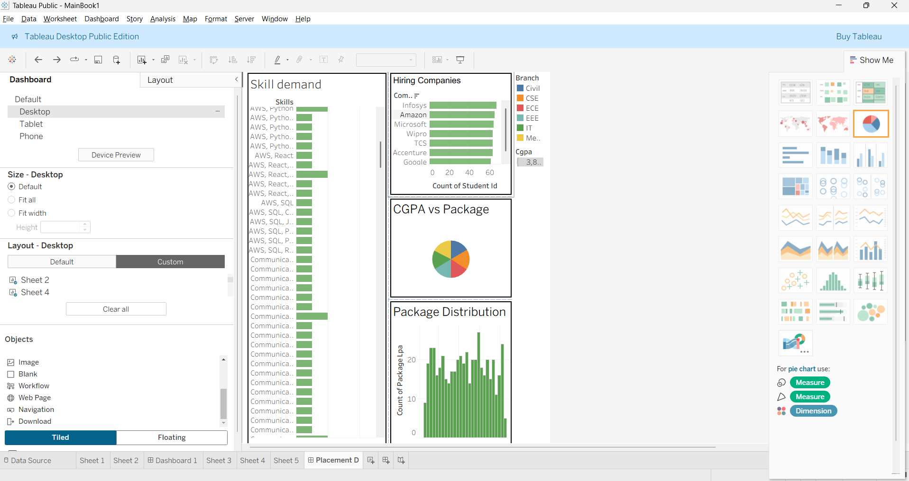

# 📊 Placement Insights Dashboard

An interactive data analytics dashboard to analyze campus placement trends such as top hiring companies, salary distribution, and skill demand.

## 🚀 Live Demo
https://jzgvjaq7k7xvxthzetaehs.streamlit.app

## 💻 GitHub Repository
https://github.com/ombhong29/Data-Analysis-Dashboard-Placement-Insights-

## 📷 Dashboard Preview

## 📊 Key Features
- Placement rate analysis
- Top hiring companies
- Most in-demand skills
- Package distribution
- CGPA vs package relationship

## 🛠 Tech Stack
- Python
- Pandas
- Streamlit
- Data Visualization

## 📈 Insights
The dashboard helps identify hiring trends, high-paying companies, and important skills required for campus placements.
